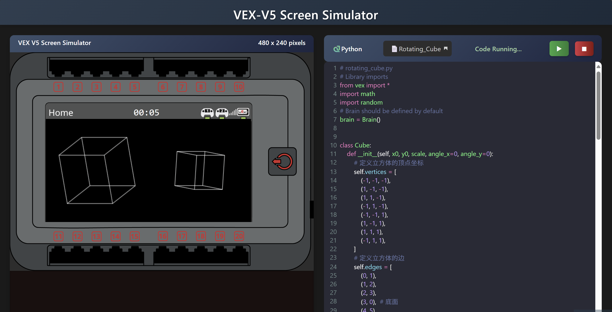

# VEX-V5 Screen Simulator

**[[English]](README.md)**
**[[中文]](README_zh.md)**

Click to access the [VEX-V5 Screen Simulator](https://mengchuiru.github.io/VEX-V5-Screen-Simulator) to get started.



## Overview

The **VEX-V5 Screen Simulator** is a browser-based interactive tool that allows users to simulate the screen display and interaction features of the VEX V5 robot using Python programming. The project provides a complete development environment, including a code editor, real-time preview, and output console—making it an ideal tool for VEX robotics beginners and educators.

You can use the VEX class：
`Brain` 
`FontType` 
`Color`

## Key Features

- **Real-Time Screen Simulation**: Simulates a 480x240 pixel VEX V5 screen.
- **Python Programming Environment**: Built-in code editor with Python syntax highlighting and auto-completion.
- **Example Programs**: Includes multiple preloaded example programs such as:
  - Rotating Cube
  - Brick Breaker
  - Code Rain
- **Touch Interaction**: Supports touch/mouse interaction on the canvas.
- **Runtime Timer**: Displays program execution time.
- **Output Console**: Shows real-time output and error messages from the program.
- **File Management**: Allows uploading local Python files.

## Technology Stack

- **Frontend Framework**: Pure HTML/CSS/JavaScript
- **Python Runtime**: Brython (Python in the browser)
- **Code Editor**: CodeMirror
- **Graphics Rendering**: HTML5 Canvas

## Quick Start

### Use Online

Simply visit the [VEX-V5 Screen Simulator](https://mengchuiru.github.io/VEX-V5-Screen-Simulator) to start using the tool directly in your browser.

### Run Locally

1. Clone the repository:
   ```bash
   git clone https://github.com/mengchuiru/vex-v5-simulator.git
   cd vex-v5-simulator
   ```

2. Start a local server:
   ```bash
   # Using Python's built-in server
   python -m http.server 8000
   ```

3. Open your browser and go to:
   ```
   http://localhost:8000
   ```

## User Guide

### Interface Overview

1. **Screen Simulation Area**: Displays the simulated VEX V5 screen.
2. **Code Editor**: Where you write and edit Python code.
3. **Control Buttons**:
   - ▶ Run code
   - ⏹ Stop and clear the canvas
4. **Example Selector**: Load predefined sample programs.
5. **Output Console**: Displays runtime output and errors.
6. **Runtime Timer**: Shows how long the program has been running.

### Basic Operations

1. Select a sample program from the Example Selector.
2. Click the ▶ button to run the program.
3. Interact with the canvas (touch/click).
4. Click the ⏹ button to stop and reset the simulation.
5. Modify the code and re-run to see changes.

### Custom Development

You can write Python code using the following API:

```python
from vex import *

# Initialize the brain
brain = Brain()

# Set colors
brain.screen.set_pen_color(Color.RED)
brain.screen.set_fill_color(Color.BLUE)

# Draw shapes
brain.screen.draw_rectangle(100, 100, 50, 50)
brain.screen.draw_circle(200, 120, 30)

# Display text
brain.screen.print_at("Hello VEX!", x=50, y=50)

# Wait
wait(1000)

# Clear screen
brain.screen.clear_screen()
```

## Contributing

Contributions are welcome! Please follow these steps:

1. Fork the repository.
2. Create a feature branch (`git checkout -b feature/your-feature`).
3. Commit your changes (`git commit -am 'Add some feature'`).
4. Push to the branch (`git push origin feature/your-feature`).
5. Open a Pull Request.

## License

This project is licensed under the [MIT License](LICENSE).

## Contact

If you have any questions or suggestions, feel free to reach out:
- Email: mengchuiru@qq.com
- Project Repository: [GitHub - vex-v5-simulator](https://github.com/mengchuiru/vex-v5-simulator)

---

**Make VEX Robotics Programming More Intuitive and Efficient!** 🚀

--- 